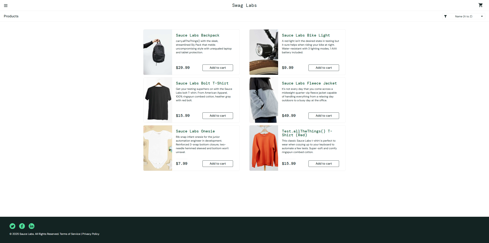
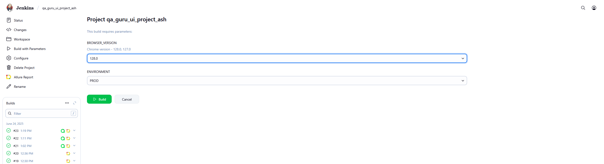
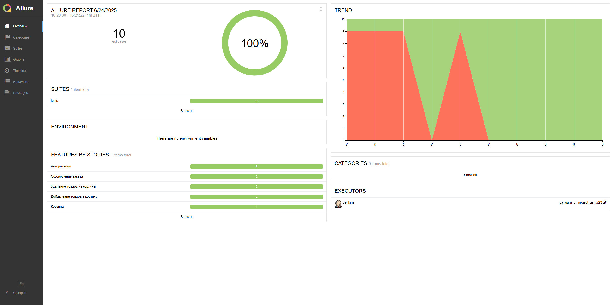
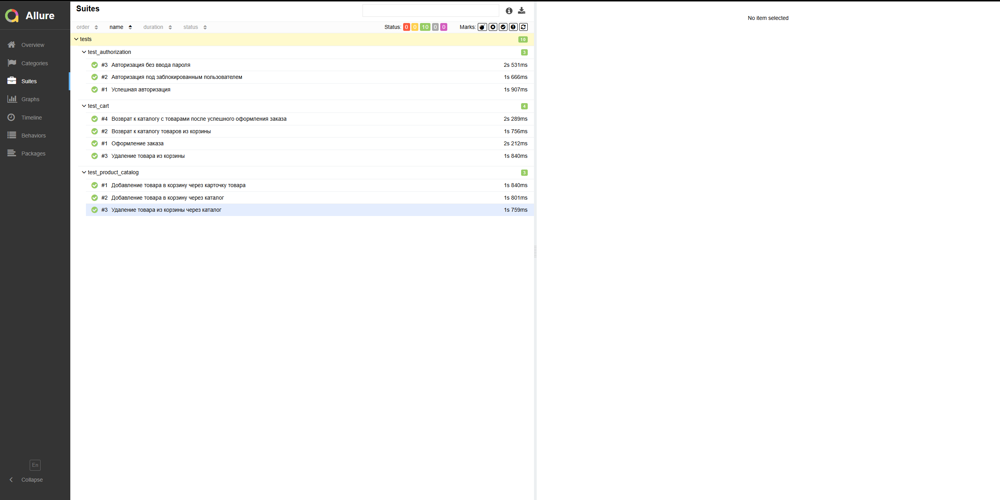
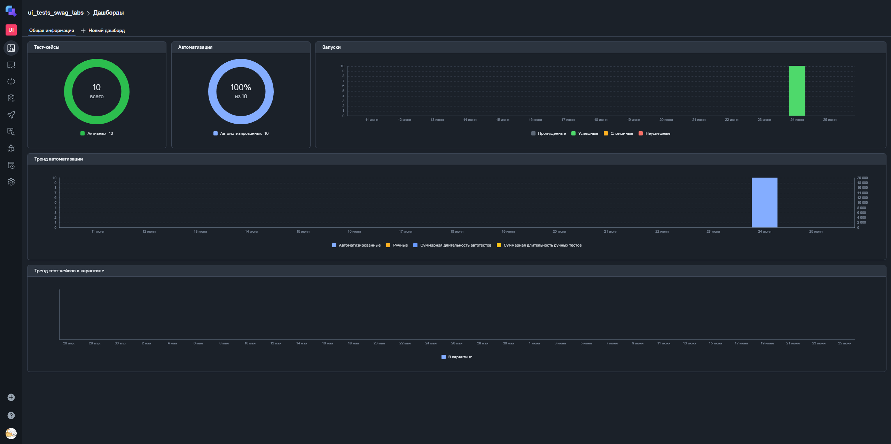
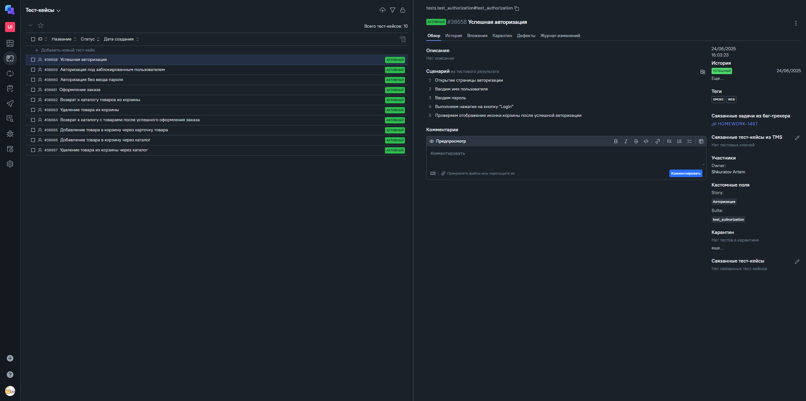
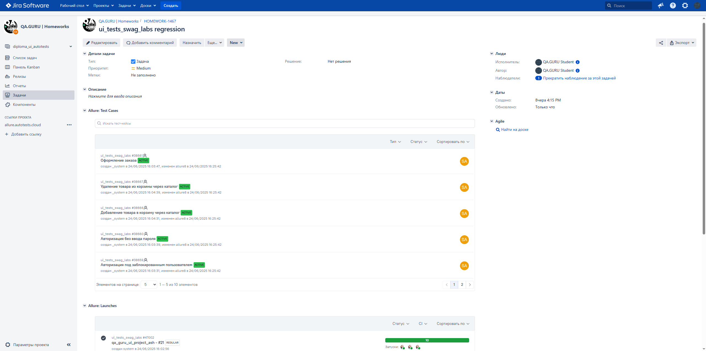
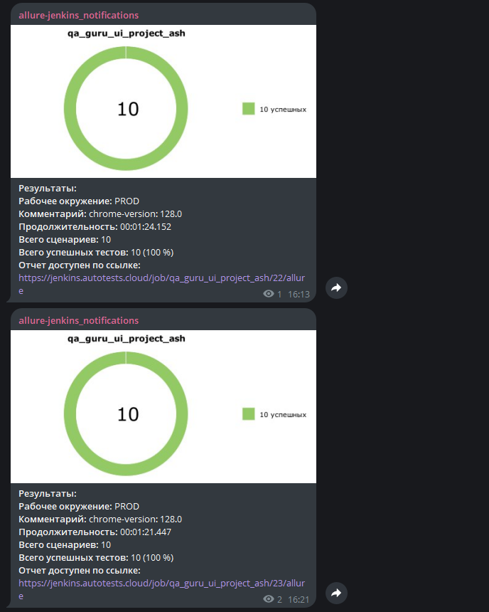

# 
 Проект по автоматизированному тестированию проекта Swag Labs 

> <a target="_blank" href="https://www.saucedemo.com/">Swag Labs</a>

<!-- Технологии -->

### Используемые технологии

  

 
  

<!-- Тестовые сценарии -->
Реализованные тестовые сценарии:

* Авторизация  
>* ✅ Успешная авторизация
>* ✅ Авторизация под заблокированным пользователем
>* ✅ Авторизация без ввода пароля
* Оформление заказа  
>* ✅ Оформление заказа
>* ✅ Возврат к каталогу с товарами после успешного оформления заказа
* Корзина  
>* ✅ Добавление товара в корзину через каталог
>* ✅ Добавление товара в корзину через карточку товара
>* ✅ Удаление товара из корзины
>* ✅ Удаление товара из корзины через каталог
>* ✅ Возврат к каталогу товаров из корзины

<!-- Jenkins -->

###  Запуск проекта в Jenkins

##### Для запуска автотестов в Jenkins

1. Открыть <a target="_blank" href="https://jenkins.autotests.cloud/job/qa_guru_ui_project_ash/">Проект в Jenkins</a>
2. Выбрать пункт `Build with Parameters`
3. Выбрать окружение в выпадающем списке ENVIRONMENT
4. Выбрать версию в BROWSER_VERSION 
5. Нажать кнопку `Build`
6. Результат прохождения тестов можно увидеть в Allure отчете или в Allure Testops

<!-- Allure report -->

###  Allure report

>##### Результаты выполнения тестова можно посмотреть в Allure-отчете.

>##### Сформированный сьют с тест-кейсами из тестового прогона отображается в вкладке "Suites".

<!-- Allure TestOps -->

###  Интеграция с Allure TestOps

>##### Ссылка на <a target="_blank" href="https://allure.autotests.cloud/project/4810/dashboards">Dashboard</a>

>##### Тест-кейсы сформированные в рамках прохождения тестового прогона

<!-- Jira -->

###  Интеграция с Jira

>##### Реализована интеграция Allure TestOps с Jira, в задачу из Jira можно добавить список тест-кейсов и результат тестового прогона по ним.

<!-- Telegram -->

###  Оповещения в Telegram
>##### После завершения джобы, в Telegram bot приходит уведомление с графиком и информацией о тестовом прогоне.

